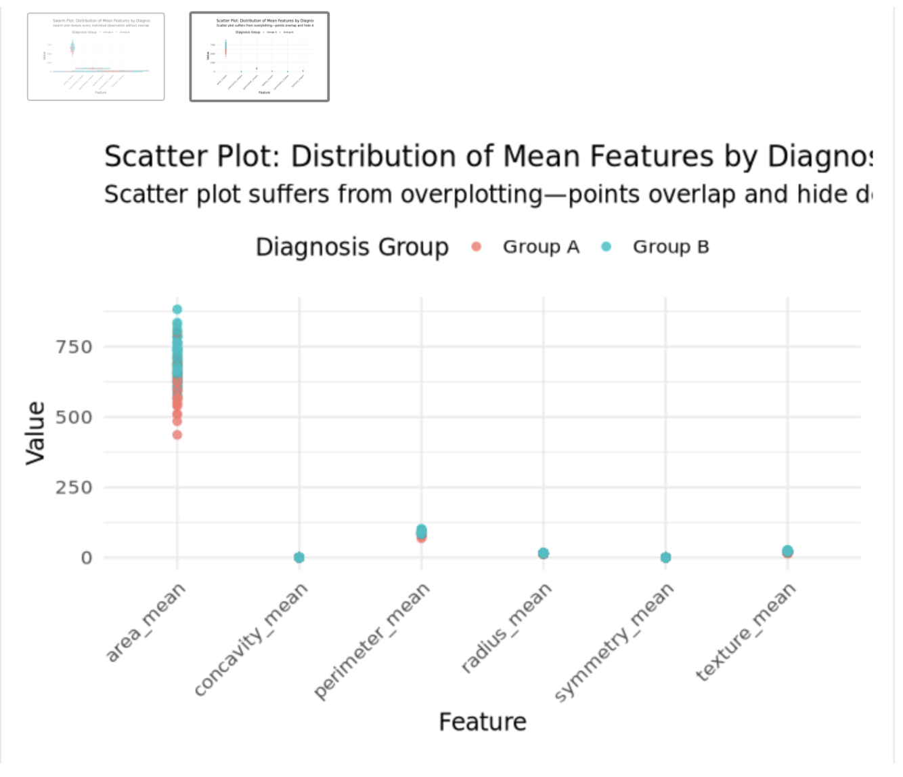
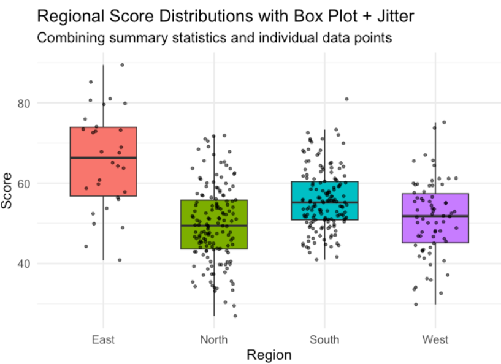
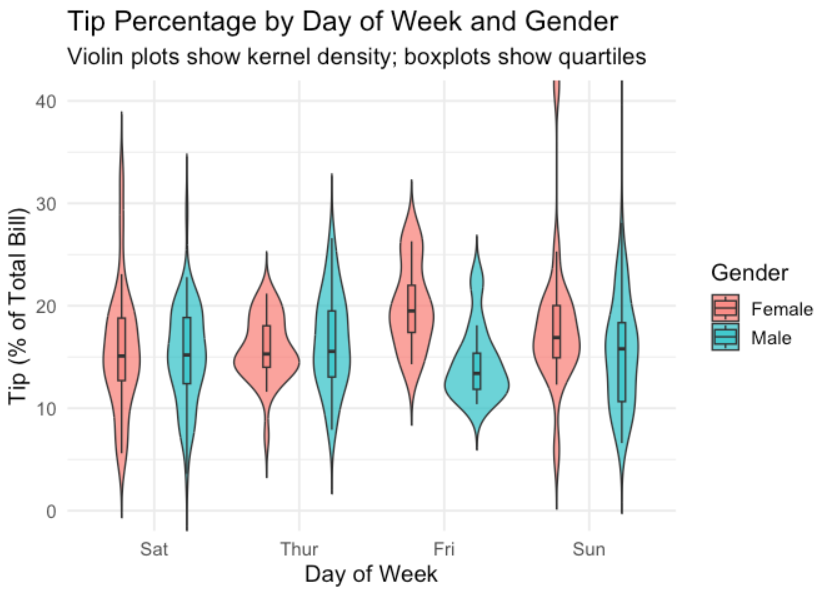
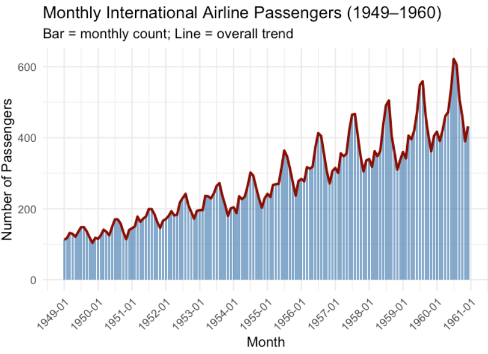
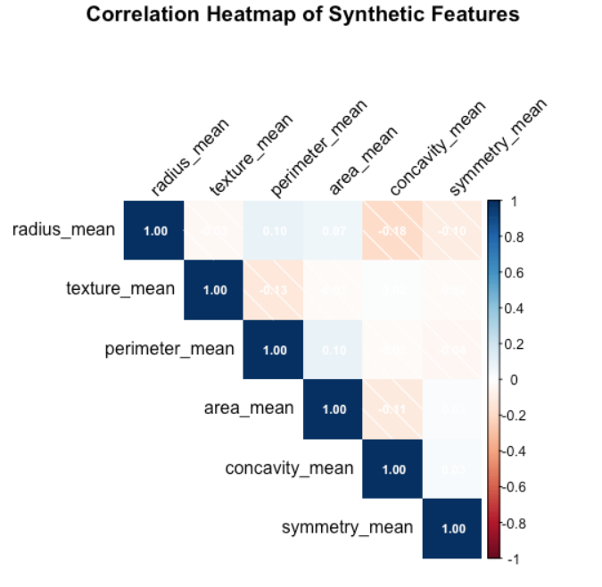
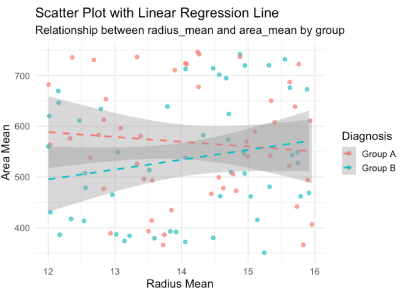

# Visualize Better with R
[](https://github.com/GESIS-Methods-Hub/guidelines-for-tutorials)
  

**Author:** Shyam Gupta ([ORCID](https://orcid.org/0009-0003-4639-5618))  
**Email:** shyam.gupta@gesis.org  
**Affiliation:** GESIS Leibniz Institute for the Social Sciences  
**Date:** 2025-04-10  


### Learning Objective
I was working on a social science research project—trying to decode the relationship between people’s well-being and their social interactions. After spending hours collecting survey responses, I realized that raw numbers alone weren’t telling the entire story.

> “I needed a better way to visualize my data to spot trends, patterns, and outliers.”  
> That is when my journey with data visualization in **R** began.

By completing this tutorial, you will:

1. Understand the strengths and limitations of each visualization type.
2. Be able to implement and customize these visualizations in `ggplot2` and related packages.
3. Interpret results in the context of social science data exploration.
4. Apply best practices to ensure clarity, accessibility, and reproducibility of your plots.

In this tutorial, I’ll walk you through the plots and visual techniques. I’ll share each plot, explaining *why* you might want to use them, *what* they reveal, and *how* to make them.

By the end of this tutorial, you’ll have a handy arsenal of 9 powerful visualization techniques perfect for social science data exploration. Let’s get started!

## Target Audience

This tutorial is designed for:

- **Social Science Researchers & Graduate Students:** Those analyzing survey or observational data who need clear, reproducible visualizations to support hypotheses and publications.
- **Data Analysts & Statisticians:** Professionals exploring complex datasets in R who want to expand their toolbox with advanced plotting techniques.
- **Academic Instructors & Educators:** Teachers seeking structured examples to demonstrate best practices in data visualization to social science students.
- **Interdisciplinary Teams & Policy Analysts:** Practitioners who require accessible, publication-quality figures to communicate insights to stakeholders and decision-makers.

## Computational Environment Setup

Ensure you have **R (version 3.6.0 or higher)** installed on your system.  
You can download it from: https://cran.r-project.org/.

Install the required R packages by running:

```{r}
# Core data wrangling & plotting
install.packages("dplyr")
install.packages("tidyr")
install.packages("hrbrthemes")
install.packages("ggplot2")

# Specialized geoms
install.packages("ggbeeswarm")
install.packages("forcats")

# Time series utilities
install.packages("zoo")

# Correlation plotting
install.packages("corrplot")

# Mapping
install.packages("maps")
install.packages("viridis")     # for color scales on maps

# (Optional) Color‐blind–friendly palettes
install.packages("viridisLite")
```

## Duration

- **Reading & Setup:** 5 minutes
- **Code Walkthrough:** 20–30 minutes
- **Hands-on Practice:** 10–15 minutes

Total: **35–50 minutes**

## Input Data

#### Generate a toy dataset with two features and a group indicator
## Input Data

```{r}
# 1. load necessary libraries 

library(dplyr)       # Data manipulation
library(tidyr)       # Data reshaping
library(ggplot2)     # Core plotting package
library(ggbeeswarm)  # For geom_beeswarm()
```


```{r}
# 2. Generate synthetic dataset

set.seed(42)
n <- 100
diagnosis <- sample(c("Group A", "Group B"), n, replace = TRUE)

# Group-specific means and correlations
radius_mean <- rnorm(n, mean = ifelse(diagnosis == "Group A", 14, 15), sd = 0.7)
texture_mean <- rnorm(n, mean = ifelse(diagnosis == "Group A", 18, 22), sd = 2)
perimeter_mean <- radius_mean * 6 + rnorm(n, 0, 3) # correlated with radius
area_mean <- radius_mean^2 * pi + rnorm(n, 0, 30)  # correlated with radius
concavity_mean <- rbeta(n, shape1 = ifelse(diagnosis == "Group A", 2, 4), shape2 = 10)

df <- data.frame(
  radius_mean = radius_mean,
  texture_mean = texture_mean,
  perimeter_mean = perimeter_mean,
  area_mean = area_mean,
  concavity_mean = concavity_mean,
  symmetry_mean = symmetry_mean,
  diagnosis = diagnosis
)
```


```{r}
# 3. Reshape data from wide to long format
# data before reshaping
head(df)
#    - pivot_longer(): collapse multiple feature columns into key-value pairs

df_long <- df %>%
  pivot_longer(
    cols = radius_mean:symmetry_mean,
    names_to = "feature",
    values_to = "value"
  )
# data after reshaping
head(df_long)
```


## 1. Swarm Plots over Scatter Plots

**The Discovery:**  
My first big “aha” moment came when I had to compare numerical data (like response scores) across different groups (like age brackets). I found that regular scatter plots overlapped points too much—making it hard to see the data distribution.

**The Hero (Swarm Plot):**  
A **swarm plot** is useful when you want to display the distribution of a numerical variable across different categories *without losing individual data points*. Unlike simple scatter plots, swarm plots arrange points to avoid overlap, helping you see each observation more clearly.

**When to Use:**  
- You have a moderate number of data points (not too large).  
- You want to see each individual data point by category.  
- You want a more “transparent” view of the distribution than a box or violin plot alone can provide.

```{r}
# 2. Create a swarm plot
#    - aes(x=feature, y=value): map feature names on x-axis and values on y-axis
#    - color by diagnosis group

# Swarm plot
swarm_plot <- ggplot(df_long, aes(x = feature, y = value, color = diagnosis)) +
  geom_beeswarm(alpha = 0.8, size = 2) +
  theme_minimal(base_size = 14) +
  labs(
    title = "Swarm Plot: Distribution of Mean Features by Diagnosis Group",
    subtitle = "Swarm plot reveals every individual observation without overlap",
    x = "Feature",
    y = "Value",
    color = "Diagnosis Group"
  ) +
  theme(
    axis.text.x = element_text(angle = 45, hjust = 1),
    legend.position = "top"
  )
print(swarm_plot)

# Scatter plot for comparison
scatter_plot <- ggplot(df_long, aes(x = feature, y = value, color = diagnosis)) +
  geom_point(alpha = 0.8, size = 2, position = position_jitter(width = 0)) +
  theme_minimal(base_size = 14) +
  labs(
    title = "Scatter Plot: Distribution of Mean Features by Diagnosis Group",
    subtitle = "Scatter plot suffers from overplotting—points overlap and hide density",
    x = "Feature",
    y = "Value",
    color = "Diagnosis Group"
  ) +
  theme(
    axis.text.x = element_text(angle = 45, hjust = 1),
    legend.position = "top"
  )
print(scatter_plot)
```




### interpretation of why choose swarm plot over scatter plot 
Swarm plots are preferred over scatter plots when visualizing categorical groupings of continuous data because they prevent overplotting—each data point is visible and not hidden behind others. In scatter plots, especially with many overlapping points, it's hard to assess the true distribution or spot clusters and outliers. Swarm plots arrange points to minimize overlap, making the sample size, density, and group differences much clearer at a glance.

### Explanation & Interpretation

- **geom_beeswarm():** Positions points in a compact, non-overlapping arrangement. Useful for moderate sample sizes (<200).  
- **Transparency (`alpha`):** Helps reveal point density when slight overlap occurs.  

**Interpretation:** In the resulting plot, clusters of points indicate where many observations fall. Differences in the vertical spread between Group A and Group B highlight variability in that feature.

### Customization Tips

- **Point shape & size:** use `shape=` and `size=` inside `geom_beeswarm()`.  
- **Color palettes:** integrate `scale_color_brewer(palette = "Set1")` or `scale_color_viridis_d()` for colorblind-friendly palettes.  
- **Grouping multiple categories:** for more than two groups, ensure contrast in color or shape.

### Common Pitfalls

- **Large datasets:** for >500 points, swarm plots can become cluttered; consider violin or box plots instead.  
- **Uneven group sizes:** extremely small groups may appear as lone points; annotate directly if needed.


## 2. Density Plots

**The Discovery:**
Next, I wanted to understand the distribution of responses for certain questions (like “level of trust in institutions”) across two demographic segments. A bar chart wasn’t capturing the shape of each distribution. A histogram might work, but I wanted a smoothed look.

**The Hero (Density Plot):**
A density plot provides a smoothed curve of the distribution. It’s like a refined histogram where you can compare the shapes of different groups without the rough bin edges.

**When to Use:**

* You want to see the distribution (shape, skew, modality) of a numerical variable.
* You have one or more categorical variables to compare (e.g., Group A vs. Group B).
* A smoother visualization of distribution is more intuitive than a histogram.

```{{}r}
# Create density plot

density_plot <- ggplot(df, aes(x = area_mean, fill = diagnosis)) +
  geom_density(alpha = 0.5, adjust = 1.2) + # adjust smoothness parameter
  theme_minimal(base_size = 14) +
  labs(
    title = "Density Plot of Area Mean by Diagnosis Group",
    subtitle = "Smoothed distribution of 'area_mean' across groups",
    x = "Area Mean",
    y = "Density",
    fill = "Group"
  )

print(density_plot)

```


### Explanation & Interpretation

- **adjust:** controls bandwidth of density estimation (higher = smoother).  
- **alpha:** semi-transparency allows overlapping fills to be distinguishable.  

**Interpretation:** Overlap between curves indicates similar distributions. Divergence reveals differences in modality or skewness.

### Customization Tips

- To overlay median lines: add `geom_vline(data = summary_df, aes(xintercept = median), linetype = "dashed")`.  
- Compare more than two groups: use faceting (`facet_wrap(~diagnosis)`).  
- Show rug plots: `geom_rug(alpha = 0.3)` adds tick marks for individual observations.

### Common Pitfalls

- Misleading smoothing: overly small `adjust` can produce spurious bumps; overly large can mask real structure.  
- Overlapping groups of very different sample sizes: transparency alone may not suffice—consider facetting or scaling.


## 3. Box Plots with Jitter

**The Discovery:**
Sometimes, I needed a quick sense of how responses (like “support for policy X”) varied across multiple categories (such as different regions). A **box plot** shows median, quartiles, and outliers, but I still wanted to see *some* individual points.

**The Hero (Box Plot + Jitter):**
By adding a jittered layer of points over the box plot, you get summary statistics and a look at each observation. This helps you see if outliers are truly outliers or part of a cluster.

**When to Use:**

* You have at least one categorical variable and one numeric variable.
* You want summary statistics plus raw data.
* You’re dealing with moderate sample sizes.

```{r boxjitter-setup, message=FALSE}
library(ggplot2)
set.seed(123)
data_box <- data.frame(
  region = rep(c("North","South","East","West"), times = c(150, 150, 30, 70)),
  score  = c(rnorm(150, 50, 10), rnorm(150, 55, 8), rnorm(30, 65, 12), rnorm(70, 52, 9))
)
```

```{r boxjitter-plot, fig.width=7, fig.height=5}
# Create boxplot + jitter
box_jitter <- ggplot(data_box, aes(x = region, y = score, fill = region)) +
  geom_boxplot(width = 0.6, outlier.shape = NA) +  # remove default outliers
  geom_jitter(width = 0.2, size = 1, alpha = 0.6, color = "black") +
  theme_minimal(base_size = 14) +
  labs(
    title = "Regional Score Distributions with Box Plot + Jitter",
    subtitle = "Combining summary statistics and individual data points",
    x = "Region",
    y = "Score"
  ) +
  theme(legend.position = "none")

print(box_jitter)
```





## 4. Violin Plot

**The Discovery:**
I wanted to see not just the median and quartiles but the full *kernel density* shape of my data. A **violin plot** shows both summary statistics and density.

**The Hero (Violin Plot):**
Violin plots combine box plot and density plot ideas, giving you a wider view of distribution for each category.

**When to Use:**

* Similar to box plots, but you care about the full distribution shape.
* Comparing multiple groups where you want a holistic view.

```{r violin-setup, message=FALSE}
library(ggplot2)
library(dplyr)
library(forcats)

# Load example dataset
url <- "https://raw.githubusercontent.com/holtzy/data_to_viz/master/Example_dataset/10_OneNumSevCatSubgroupsSevObs.csv"
data_violin <- read.csv(url) %>%
  mutate(tip_pct = round(tip/total_bill * 100, 1))
```

```{r violin-plot, fig.width=7, fig.height=5}
# Create violin plot
violin_plot <- ggplot(data_violin, aes(x = fct_reorder(day, tip_pct), y = tip_pct, fill = sex)) +
  geom_violin(position = position_dodge(width = 0.9), alpha = 0.7, trim = FALSE) +
  geom_boxplot(width = 0.1, position = position_dodge(width = 0.9), outlier.shape = NA, alpha = 0.5) +
  coord_cartesian(ylim = c(0, 40)) +
  labs(
    title = "Tip Percentage by Day of Week and Gender",
    subtitle = "Violin plots show kernel density; boxplots show quartiles",
    x = "Day of Week",
    y = "Tip (% of Total Bill)",
    fill = "Gender"
  ) +
  theme_minimal(base_size = 14)

print(violin_plot)
```



### Explanation & Interpretation

- **trim = FALSE:** Display full tail of density beyond data range.  
- **geom_boxplot():** Adds quartile summary inside violins.  

**Interpretation:** Wider sections of the violin indicate where tips concentrate. Differences between days/genders highlight behavioral patterns.

### Customization Tips

- Adjust bandwidth with `geom_violin(..., adjust = 1.5)`.  
- Flip coordinates (`coord_flip()`) for horizontal violins if labels overlap.

### Common Pitfalls

- Very small sample sizes: density estimation may be misleading—consider using jitter only.


## 5. Bar + Line Plot

**The Discovery:**
When analyzing time-series survey data (e.g., monthly participant counts), I wanted both bar-chart values and a trend line.

**The Hero (Bar + Line Combo):**
Use bars for absolute values and overlay a line to depict the trend over time.

**When to Use:**

* Showing period values (bars) and overall trend (line) for time-series data.

```{r barline-setup, message=FALSE}
library(ggplot2)
library(zoo)

data("AirPassengers")
df_air <- data.frame(
  Month = as.Date(as.yearmon(time(AirPassengers))),
  Passengers = as.numeric(AirPassengers)
)
```
Now we plot the Bar + Line Combo Plot.
```{r barline-plot, fig.width=7, fig.height=5}
# Create bar + line chart
ggplot(df_air, aes(x = Month)) +
  geom_col(aes(y = Passengers), width = 25, fill = "steelblue", alpha = 0.7) +
  geom_line(aes(y = Passengers), size = 1.2, color = "darkred") +
  labs(
    title = "Monthly International Airline Passengers (1949–1960)",
    subtitle = "Bar = monthly count; Line = overall trend",
    x = "Month",
    y = "Number of Passengers"
  ) +
  scale_x_date(date_labels = "%Y-%m", date_breaks = "1 year") +
  theme_minimal(base_size = 14) +
  theme(axis.text.x = element_text(angle = 45, hjust = 1))
```


### Explanation & Interpretation

- **geom_col():** Creates bars using data values directly.  
- **geom_line():** Plots a continuous trend line across points.  
- **scale_x_date():** Customizes date axis formatting.

**Interpretation:** Seasonal peaks in summer months emerge clearly via bars, while the red trend line contextualizes year-over-year growth.

### Customization Tips

- Add moving average: compute a rolling mean (e.g., `df_air$MA <- rollmean(df_air$Passengers, 12, fill = NA)`) and overlay with `geom_line(aes(y = MA), linetype = "dashed")`.

### Common Pitfalls

- Date axis overcrowding: adjust `date_breaks` or rotate labels.  
- Inconsistent widths: ensure `width` aligns with date units (days).


## 6. Correlation Heatmap

**The Discovery:**
I needed an overview of how numerical features related. Rather than a numeric matrix, a **correlation heatmap** highlights associations at a glance.

**The Hero (Correlation Heatmap):**
A color-scaled matrix showing strength and direction of correlations.

**When to Use:**

* Dealing with multiple numerical variables.
* Quickly assessing which pairs are highly correlated.

```{r corr-setup, message=FALSE}
library(corrplot)

# Use `df` from section 1: numeric columns only
num_cols <- df %>% select(radius_mean, texture_mean, perimeter_mean, area_mean, concavity_mean, symmetry_mean)
corr_matrix <- cor(num_cols)
```

```{r corr-plot, fig.width=6, fig.height=6}
corrplot(
  corr_matrix,
  method = "shade",       # use shaded squares
  type = "upper",         # show only upper triangle
  tl.col = "black",       # variable names in black
  addCoef.col = "white",  # add correlation coefficients
  number.cex = 0.7,         # size of coefficients
  tl.srt = 45,              # rotate labels
  title = "Correlation Heatmap of Synthetic Features",
  mar = c(0, 0, 2, 0)        # margin for title
)
```


### Explanation & Interpretation

- **method:** defines tile style (`shade`, `color`, `circle`).  
- **type = 'upper':** hides redundant lower triangle.  
- **addCoef.col:** overlays numeric r-values.

**Interpretation:** High positive correlations (e.g., `perimeter_mean` vs. `radius_mean`) appear as darker tiles; near-zero appear as lighter.

### Customization Tips

- Use `corrplot.mixed()` to combine circle and number views.  
- Cluster variables with `hc.order = TRUE, order = "hclust"` for dendrogram ordering.

### Common Pitfalls

- Correlation does not imply causation: always inspect scatter plots for nonlinear patterns.  
- Including non-numeric data: ensure you select only numeric columns.


## 7. Scatter Plot with Regression Line

**The Discovery:**
I often wondered if one factor could predict another—like, does “annual income” predict “charitable donations”?

**The Hero (Scatter + Regression):**
Overlay a linear regression line on a scatter plot to gauge trend direction and strength.

**When to Use:**

* Examining relationship between two numerical variables.
* Getting a quick visual indication of a linear trend.

```{r scatter-setup, message=FALSE}
# Reuse `df` from section 1
ggplot2::theme_set(theme_minimal(base_size = 14))
```

```{r scatter-plot, fig.width=7, fig.height=5}
scatter_reg <- ggplot(df, aes(x = radius_mean, y = area_mean, color = diagnosis)) +
  geom_point(alpha = 0.7, size = 2) +
  geom_smooth(method = "lm", se = TRUE, linetype = "dashed") +
  labs(
    title = "Scatter Plot with Linear Regression Line",
    subtitle = "Relationship between radius_mean and area_mean by group",
    x = "Radius Mean",
    y = "Area Mean",
    color = "Diagnosis"
  )

print(scatter_reg)
```




### Explanation & Interpretation

- **geom_smooth(method = 'lm', se = TRUE):** adds linear model fit with shaded confidence band.  

**Interpretation:** The slope of the dashed line indicates the strength and direction of the linear relationship. Overlapping confidence bands suggest similar slopes across groups or pooled data.

### Customization Tips

- To fit separate models per group: include `aes(group = diagnosis)` inside `geom_smooth()`.  
- For nonlinear trends: use `method = 'loess'`.

### Common Pitfalls

- Overfitting with LOESS on large samples—consider limiting points or bandwith.  
- Outliers can disproportionately influence linear fit.

## 8. Stacked Bar Charts

**The Discovery:**
I wanted to show how responses divided among categories (like political affiliation vs. policy preference). A **stacked bar chart** does this intuitively.

**The Hero (Stacked Bar Chart):**
Compares total counts and internal composition of each group.

**When to Use:**

* You have two or more categorical variables.
* You want overall counts and proportional breakdown.

```{r}
set.seed(123)
df_stack <- data.frame(
  Region     = sample(c("North","South","East","West"), 200, TRUE),
  Preference = sample(c("Support","Oppose","Neutral"), 200, TRUE)
)

ggplot(df_stack, aes(x = Region, fill = Preference)) +
  geom_bar(position = "stack") +
  labs(
    title = "Stacked Bar Chart of Preferences by Region",
    x     = "Region",
    y     = "Count"
  ) +
  theme_minimal()
```


## 9. Maps: Choropleth & Point Map

**The Discovery:**  
I noticed that survey responses and social indicators often have strong geographic patterns—regions with similar characteristics cluster together. Traditional charts couldn’t reveal these spatial relationships. Mapping data onto geographic outlines and points immediately highlights regional hotspots and geographic trends.

**The Hero (Choropleth & Point Maps):**  
- **Choropleth Map:** Colors fill geographic regions (e.g., states or countries) by aggregated metrics, allowing you to spot regional differences at a glance.  
- **Point Map:** Overlays data points (e.g., cities with event counts) on a geographic background, with point size or color encoding additional variables.

**When to Use:**  
- **Choropleth:** You have region-level aggregated data (e.g., state-level social index, county-level voting percentages).  
- **Point Map:** You have point-level observations (e.g., survey locations, incidents) and want to visualize spatial distribution or density.  
- **Combined Use:** Compare overall regional patterns (choropleth) with specific event clusters or outliers (points).

```r
# US Choropleth Map
library(ggplot2)
library(maps)
library(dplyr)

states_map <- map_data("state")
state_data <- data.frame(
  region       = tolower(state.name),
  social_index = runif(50, 0, 100)
)

us_data <- left_join(states_map, state_data, by = "region")

ggplot(us_data, aes(long, lat, group = group, fill = social_index)) +
  geom_polygon(color = "white") +
  coord_fixed(1.3) +
  theme_minimal() +
  labs(
    title = "US States Social Index Choropleth",
    fill  = "Social Index"
  )

# World Point Map
world_map <- map_data("world")
cities    <- data.frame(
  city        = paste("City", 1:30),
  long        = runif(30, -180, 180),
  lat         = runif(30, -90, 90),
  event_count = sample(1:100, 30, TRUE)
)

ggplot() +
  geom_polygon(
    data = world_map,
    aes(long, lat, group = group),
    fill  = "gray90",
    color = "white"
  ) +
  geom_point(
    data  = cities,
    aes(long, lat, size = event_count),
    alpha = 0.7
  ) +
  coord_fixed(1.3) +
  theme_minimal() +
  labs(
    title = "Global Social Event Locations (Synthetic Data)",
    size  = "Event Count"
  )
```


- coord_fixed(1.3): ensures correct aspect ratio for maps.  
- scale_fill_viridis_c(): continuous palette that is perceptually uniform.

- Use `coord_quickmap()` for faster rendering on large world datasets.  
- Cluster overlapping points with `geom_jitter()` on lat/long or use packages like `sf` + `ggspatial`.

**Interpretation:** Darker states have higher social index values in this synthetic example; look for regional clusters (e.g., coastal vs. inland patterns).

## Conclusion

With this tutorial, you now have more weapons in your arsenal to use R and visualize better to draw insights from your data.

## References and Reading Material

* **South East Asia Analytics** – [Kaggle Notebook](https://www.kaggle.com/code/caesarmario/southeast-asia-happiness-report-2021#3.-%7C-Top-4-Countries-%F0%9F%8F%864%EF%B8%8F%E2%83%A3)
* **Mental Health Viz** – [Kaggle Notebook](https://www.kaggle.com/code/melissamonfared/mental-health-music-relationship-analysis-eda)
* **R for Data Science** (Wickham & Grolemund) – A comprehensive guide on data manipulation and visualization in R.
* **Data to Viz** – [data-to-viz.com](https://www.data-to-viz.com/) for insights on selecting the right chart type.


